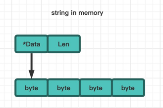

## 基本类型

### 整形

golang支持不同字节数的整形。

|定义|字节|表示范围|
|---|---|---|
|int8|1字节|1字节=8位，1位用来表示符号，剩下7位表示数据大小。-2^7~2^7-1(-128~127), uint8表示0~255以下同理|
|int16|2字节|-2^15~2^15-1，6w+|
|int32|4字节|-2^31~2^31-1，21亿+|
|int64|8字节|-2^63~2^63-1|
|int|8字节|-2^63~2^63-1，在32位的机器上是4字节，在64位的机器上是8字节|

### 浮点数

golang和其他语言一样，依旧存在浮点数精度丢失的问题。

精度丢失的原因在于：二进制无法精确表示十进制的小数，比如1/3=0.33333...，二进制只能采用一个近似值来表示。在用二进制和十进制之间转换的时候肯定就会出现精度丢失的情况。

精度丢失的解决：使用`decimal`包

```Go
import (
	"github.com/shopspring/decimal"
	"log"
)

var num1 = 19.9
log.Println(num1 * 100) //等于1989.9999999999998
//采用decimal包解决
re, _ := decimal.NewFromFloat(num1).Mul(decimal.NewFromInt(100)).Float64()
log.Println(re)
```

### 字符

让我们先来回顾一下`ASCII`，`unicode`，`utf-8`这几个概念。详见[这篇文章](/knowledge/linux/base/coding.html)

字符在goalng中的使用不是特别常见。

定义一个字符。
```Go
var c byte = 'a'
```

输出一个字符，会直接输出它对应的ASCII码。
```Go
log.Println(c)//97
```

格式化输出字符，才会输出它对应的值。
```Go
log.Printf("%c", 97)//a
```

一个byte是int8，只有一个字节大小，如果用中文utf-8编码的情况下(3/4个字节)会溢出，GBK编码2字节也会溢出，编译失败。
```Go
var z byte = '中'//constant 20013 overflows byte
```

可以用一个int32或者int64来存放单个中文汉字，然后格式化输出。
```Go
var zh int = '中'//注意是单引号哦，表示单个字符
log.Printf("%c", zh)//中
```

### 字符串

#### 简介

字符串是由字符组成的数组，string之于byte类似c中的字符串char[]之于char。

但是，go中的字符串是由一个结构体构成的，源码定义如下：

```Go
type StringHeader struct {
	Data uintptr
	Len  int
}
```

是不是让人想起了redis的string底层数据结构之SDS。

其中`Len`字段表示字符串长度，`Data`字段是一个指针，指向的具体字符数组的第一个元素，原型图如下：



#### string和byte、rune转换

一个string由多个byte构成，直接使用`b1 := []byte("abc一")`转换即可，这样b1长度为6。

但是rune是4字节的，所以直接使用`r1 := []rune("abc一")`转换时字符串中任意字符都不超过4字节，所以任意字符都能被装在rune里面。
所以r1的长度是4。

#### 长度和截取

内置函数`len()`是输出字符串所占用的字节数。

如果想要获取字符串的字符数，有两个方法，第一是按照上面的转为[]rune，第二是使用utf8库。

```Go
import "unicode/utf8"

fmt.Println(len("abcd123490"), len("一二三四五六七八90"))//字节长度，输出10 26
fmt.Println(len([]rune("一二三四五六七八90")))//输出10
fmt.Println(utf8.RuneCountInString("一二三四五六七八90"))//字符长度，输出10
```

截取时可以按照byte或者rune截取，但是如果有中文(一个字符由多个byte构成)就容易把中文截断形成乱码，推荐转换为[]rune或者使用utf8库。

#### 打印每个字符

可以按照上面方法转为[]rune或者使用`range`

```Go
for _, s := range theme{//range后的s为rune类型，也就是int32
    fmt.Printf("unicode: %c %d \r\n", s, s)
}
```
